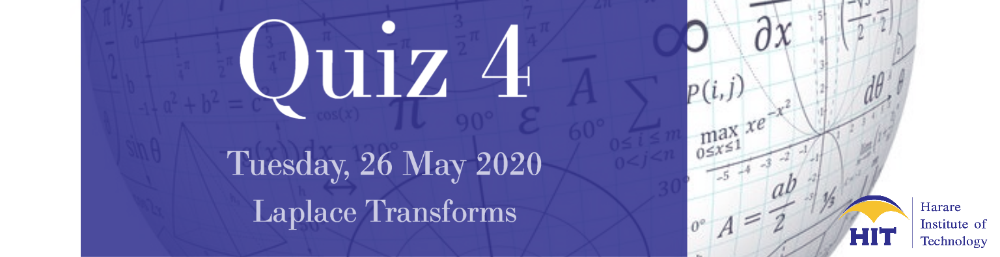

## {.tabset .tabset-fade .tabset-pills}

### Quiz/Tutorial


<center>
[{ width=100% }](https://docs.google.com/forms/d/e/1FAIpQLSc6umoW0bc-EqYG5rQlZ1y_DBG-ehzpFLWvZqDT7RRwcgJYxw/viewform?usp=sf_link)
</center>

[Laplace Transforms Quiz(Click Here)](https://docs.google.com/forms/d/e/1FAIpQLSc6umoW0bc-EqYG5rQlZ1y_DBG-ehzpFLWvZqDT7RRwcgJYxw/viewform?usp=sf_link)

Submissions open at 00:00 on Tuesday, 26 May 2020. 

Submissions close at 23:59 on Tuesday, 26 May 2020.


<script id="asp-embed-script" data-zindex="1000000" type="text/javascript" charset="utf-8" src="https://spark.adobe.com/page-embed.js"></script><a class="asp-embed-link" href="https://spark.adobe.com/page/atrXte6NsipNh/" target="_blank"></a>


[Vector Calculus Quiz(Click Here)](https://docs.google.com/forms/d/e/1FAIpQLSesWlutMbkaeOw6tuJjrAcFf6P42kbI6QOfKEqbcyfNWfaNHw/viewform?usp=sf_link)

Submissions open at 00:00 on Tuesday, 5 May 2020. 

Submissions close at 23:59 on Tuesday, 5 May 2020.

***

***
[Linear Algebra: Solved problems](https://spark.adobe.com/page/7jrCE8B0vNMtf/)

[Ordinary Differential Equations: Solved problems](https://spark.adobe.com/page/cM5VA7oCN0raT/)

[Vector Calculus: Solved Problems](https://spark.adobe.com/page/UTENv8xUsl6Es/)


***


```{r echo=FALSE}
library(readxl)
cw122b<- read_excel("1212020cw2.xlsx")
library(DT)
```


```{r echo=FALSE}
library(readxl)
cw122<- read_excel("1212020cw.xlsx")
```


```{r echo=FALSE}
cw121q123<- read_excel("cw121q123.xlsx")
library(DT)
datatable(cw121q123, rownames = FALSE,caption = 'For fast access, type your surname in the search box.',  options = list(order = list(list(1, 'asc')),pageLength = 100, scrollX=T,columnDefs=list(list(className = 'dt-center', targets = 2:5))),colnames= c("Registration","Surname","Department","Quiz 1","Quiz 2","Quiz 3") ) %>%
  formatStyle(
    'Quiz_1',
    color = styleInterval(c(0.49, 0.75), c('red', 'black', 'green')), fontWeight = 'bold') %>%
  formatPercentage('Quiz_1', 0)%>%
  formatStyle(
    'Quiz_2',
    color = styleInterval(c(0.49, 0.75), c('red', 'black', 'green')), fontWeight = 'bold') %>%
  formatPercentage('Quiz_2', 0)%>%
  formatStyle(
    'Quiz_3',
    color = styleInterval(c(0.49, 0.75), c('red', 'black', 'green')), fontWeight = 'bold') %>%
  formatPercentage('Quiz_3', 0)
```


**Note:** Quizzes  are compulsory and will contribute to your final coursework mark.
<center>

***


### Course Content
(@) Linear Algebera
(@) Ordinary Differential Equations
(@) Vector Calculus
(@) Laplace Transforms

[Course Outline (pdf)](https://drive.google.com/file/d/1YTM2qJU8BMlOpyXgHQxKCzXpT6_iHT0F/view?usp=sharing)

### Lecture Notes

[Linear Algebra I](https://drive.google.com/file/d/1djpop6x1BY1wN7lPyhQRthUcFcjGxJwL/view?usp=sharing)

[Linear Algebra II](https://drive.google.com/file/d/1wtGffPnOoLBvV5tZgAkNUJ6pw5QxxdAs/view?usp=sharing)

[Laplace Transforms](https://drive.google.com/file/d/1feoB6yBJ9zSPkRDRn_ec2XDMwue1LDcC/view?usp=sharing)

[Ordinary Differential Equations I](https://drive.google.com/file/d/1YT8uUMDoNXOC0_B0VOKAGCAntD8KKCUo/view?usp=sharing)

[Ordinary Differential Equations II](https://drive.google.com/file/d/1ZgyyM8xoNpQIhZgidEiHnwgkkaXGxEUs/view?usp=sharing)

[Ordinary Differential Equations III](https://drive.google.com/file/d/1epZNoi3RZFoSmJxAZ9ZteXXCoVncA8ME/view?usp=sharing)

[Vector Calculus I](https://drive.google.com/file/d/1DaNG9UAFp86MZFsuX0J9iT9wqPr_nXUi/view?usp=sharing)

[Vector Calculus II](https://drive.google.com/file/d/15UUpb82LWWbLsRkXt05V_j-ge30rXCYW/view?usp=sharing)


### Books

[Advanced Engineering Mathematics](https://drive.google.com/file/d/1Y-37NYSAWCiSOnlMNiFPV8aQOjJx_eWu/view?usp=sharing)

### Worksheets


[Worksheet ](https://drive.google.com/open?id=1oLNr8FYGHDIXHHfsGQBJLDx35hla-aVJ)


### Tests

#### **2019**

[Supplementary Test (2019)](https://drive.google.com/file/d/1n5QvKQ_YdXv6vsyZGn3-zBP3ereTqAwe/view?usp=sharing)

#### **2018**

[Linear Algebra Test (2018)](https://drive.google.com/file/d/1FOcgTUQv08dgWXtC3Zoq6R3__7fHsYYs/view?usp=sharing)

[ODEs Test 1 (2018)](https://drive.google.com/open?id=1uAwM8HfCnV6Uvo6vlF4vYz7Lse-MVa-c)

[Vector Calculus Test (2018)](https://drive.google.com/open?id=1rYNJ4RqZ_itoWrO290HCZBan6uKJU6w2)


### Past Examinations


***

### Course Information

<style>
div.blue { background-color:#e6f0ff; border-radius: 5px; padding: 20px;}
</style>
<div class = "blue">

Lecturer: **K Mutangi**

Office  : W16

Email   : kmutangi@gmail.com

Phone   : +263242 741428-30 Ext 2372

</div>


Assessment shall comprise of 3 in class tests and an end of semester examination. The end of semester examination counts 75%, and the continuous assessment counts 25% towards the final mark. Only those who score an average of 50% in the 3 tests will be allowed to write the end of semester 
examination. All tests and the exam are mandatory. Discuss any potential conflicts well before the test/exam date.

<style>
div.blue { background-color:#e6f0ff; border-radius: 5px; padding: 20px;}
</style>
<div class = "blue">

<center>
**Online Learning **
</center>
While physical congregation  for classes has been suspended, online learning will continue so as to minimise disruptions to the semester.

<center>
**Online Quizzes **
</center>

(@) Links to online quizzes will be posted on the respective course's webpage.
(@) Quiz dates will be posted on the notices below.
(@) The quizzes are  compulsory and will contribute to the final coursework mark.
(@) Instructions:
    * When entering your surname  the first letter must be an uppercase letter, the rest must be lowercase letters. Example: **Surname**
    * When entering the letters on your registration number, please use uppercase letters only. Example: **H000000A**
    * Only click the submit button when you have verified your answers. The submit button will be on the last page of the quiz. If a student makes  multiple submissions, only the first one will be recorded.
(@) To acquaint yourself with the quiz format click the link [Sample Quiz(Linear Aldebra, ODEs, Vector Calculus, Laplace Transforms)](https://docs.google.com/forms/d/e/1FAIpQLSdNFcWuuoTi5Oh99tnF7uLuP4qwgl_Xju6xvoCc1w7V9WDH6w/viewform?usp=sf_link).  

</div>


