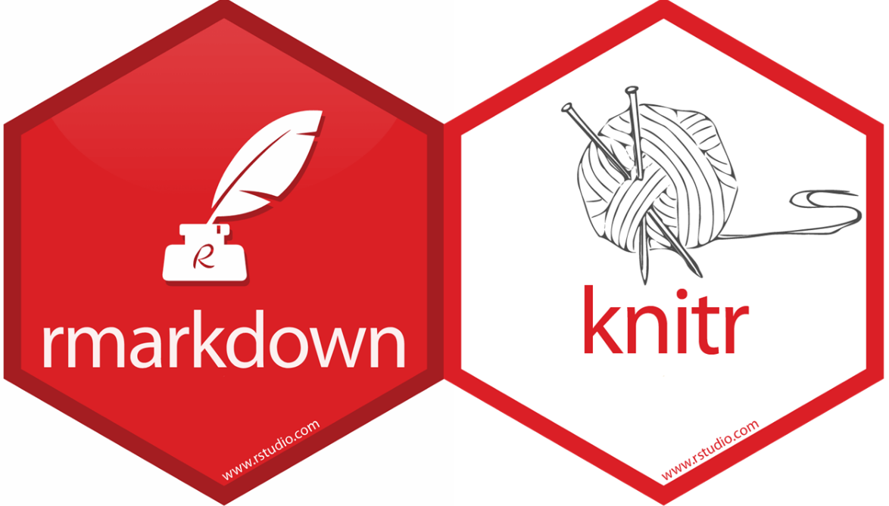

## **HIT Mathematics** {.tabset .tabset-fade}


### <span style="color:orange"> **Notices**
Assessment for the courses shall be based on continuous assessment as well as Institute examinations. Continuous assessment will contribute 25% of the overall assessment mark of that course. Continuous assessment dates are as follows:

```{r echo=FALSE}
library(readxl)
T1<- read_excel("T1.xlsx")
library(knitr)
library(kableExtra)
kable(T1) %>%
  kable_styling(bootstrap_options = c("striped", "hover", "responsive",position = "center", full_width = T)) %>%
footnote( symbol = c("Tests/Quizzes are compulsory.")) 
```

*** 

#### **Information to students carrying mathematics courses**

+ Students who intend to use coursework marks from the previous year must apply at their respective departments.
+ The endorsed applications from the departments must be submitted to the mathematics department. 
+ Submision dates: 18-22 May 2020.
+ Although not mandatory, students are encouraged to redo the continuous assessment. 


***


<center>
[{ width=8% }](https://rstudio.com)
</center>

<center>
{ width=25% }
</center>


### **HIT 121**
[HIT 121: Engineering Mathematics II](hit121.html)

### **HIT 122**
[HIT 122: Mathematics For Technologists II](hit122.html)

### **ISS 126**
[ISS 126: Number Theory](iss126.html)

### **ICS 226/ISE 225**
[ICS 226/ISE 225: Numerical Analysis](ics225.html)


