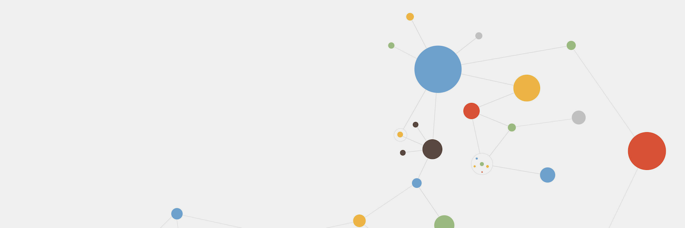

# **Mathematics Courses**

  
  <a href="hit121.html">HIT 121: Engineering Mathematics  II</a>
  
  <a href="hit122.html">HIT 122: Mathematics For Technologists II</a>
  
  <a href="iss126.html">ISS 126: Number Theory</a>
  
  <a href="ics225.html">ICS 226/ISE 225: Numerical Analysis</a>
  
  

  
<!--html_preserve-->

  
  
  

    
    

      

        
Analyze. Share. Reproduce.

        
Your data tells a story. Tell it with R Markdown. Turn your analyses into high quality documents, reports, presentations and dashboards.

        
      

    

  

  

    

      

        
<ol>
  <li>HIT 122 Test 1</li>
  <ul>
     <li> Date: Thursday 12 March 2020</li>
     <li> Time: 10:15</li>
     <li> Venue: Electronic Hall</li>
  </ul>
  <li>ISS 126 Test 1</li>
 <ul>
     <li> Date: Thursday 12 March 2020</li>
     <li> Time: 14:00</li>
     <li> Venue: S101</li>
  </ul>
</ol>
        

      

    

    
  

<!--/html_preserve-->

  