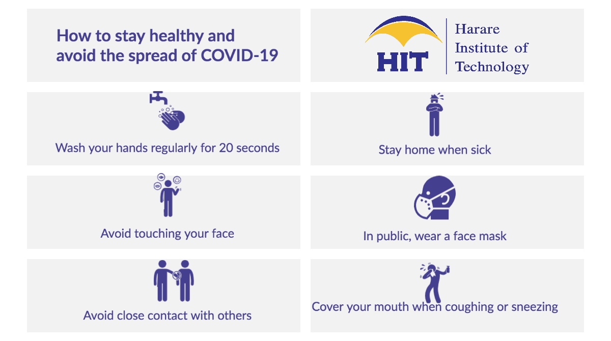

## **HIT Mathematics** {.tabset .tabset-fade}


### <span style="color:orange"> **Notices**
Assessment for the courses shall be based on continuous assessment as well as Institute examinations. Continuous assessment will contribute 25% of the overall assessment mark of that course. Continuous assessment dates are as follows:

```{r echo=FALSE}
library(readxl)
T1<- read_excel("T1.xlsx")
library(knitr)
library(kableExtra)
kable(T1) %>%
  kable_styling(bootstrap_options = c("striped", "hover", "responsive",position = "center", full_width = T)) %>%
footnote( symbol = c("Tests/Quizzes are compulsory.")) 
```

*** 
<center>
{ width=100% }
</center>


***


<center>
[{ width=8% }](https://rstudio.com)
</center>

<center>
{ width=25% }
</center>


### **HIT 113**
[Mathematics For Technologists I (click here)](https://spark.adobe.com/page/ZoaxLXcmsEkkV/)

### **ICS/IIT/ISE 114**
[Foundations of Mathematics (click here)](https://spark.adobe.com/page/AbvajQfhXv91p/)

### **ICS/ISE 215**
[Operation Research (click here)](https://spark.adobe.com/page/J9EVeozp5LDhh/)

[Decision Analysis Quiz](https://docs.google.com/forms/d/e/1FAIpQLSeYgt2Guzfy1g7jMJmW_GzE8PVBp-50DpEdSN8Nh53lmMrqwA/viewform?usp=sf_link)


### **SST 216**
[Biostatistics (click here)](https://spark.adobe.com/page/doqx2cHBZFQQ4/)


### **HIT 121**
[HIT 121: Engineering Mathematics II](hit121.html)

### **HIT 122**
[HIT 122: Mathematics For Technologists II](hit122.html)

### **ISS 126**
[ISS 126: Number Theory](iss126.html)

### **ICS 226**
[ICS 226/ISE 225: Numerical Analysis](ics225.html)


