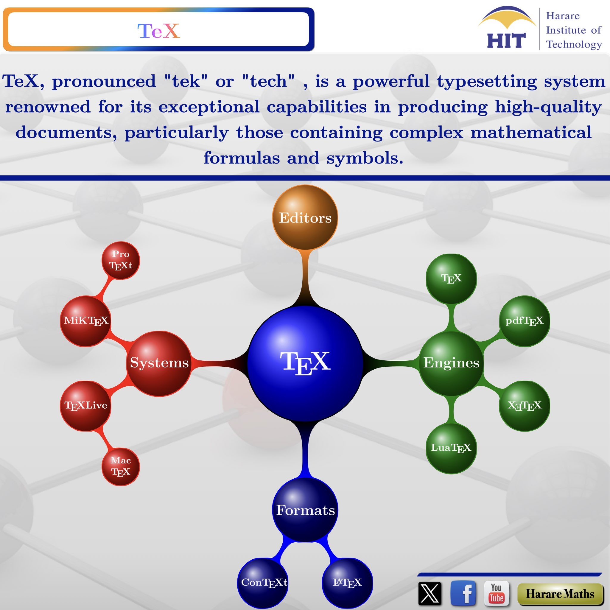

## **Harare Maths** {.tabset .tabset-fade}


### <span style="color:orange"> **Notices**
Assessment for the courses shall be based on continuous assessment as well as Institute examinations. Continuous assessment will contribute 25% of the overall assessment mark of that course. Continuous assessment dates are as follows:

```{r echo=FALSE}
library(readxl)
T1<- read_excel("T1.xlsx")
library(knitr)
library(kableExtra)
kable(T1) %>%
  kable_styling(bootstrap_options = c("striped", "hover", "responsive",position = "center", full_width = T)) %>%
footnote( symbol = c("Tests/Quizzes are compulsory.")) 
```

*** 
<center>
{ width=100% }
</center>


***


<center>
[{ width=8% }](https://rstudio.com)
</center>

<center>
{ width=25% }
</center>


