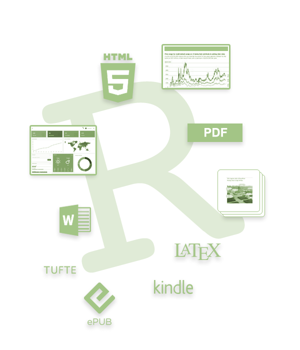

  

  <a href="hit121.html">HIT 121: Engineering Mathematics  II</a>  
  <a href="hit122.html">HIT 122: Mathematics For Technologists II</a>  
  <a href="iss126.html">ISS 126: Number Theory</a> 
  <a href="ics225.html">ICS 226/ISE 225: Numerical Analysis</a>
  
  

  

<ul>
  <li>HIT 122 Test 1</li>
  <ul>
     <li> Date: Thursday 12 March 2020</li>
     <li> Time: 10:15</li>
     <li> Venue: Electronic Hall</li>
  </ul>
  <li>ISS 126 Test 1</li>
 <ul>
     <li> Date: Thursday 12 March 2020</li>
     <li> Time: 14:00</li>
     <li> Venue: S101</li>
  </ul>
</ul>
        

  

<ul>
  <li>HIT 121 Test 1</li>
  <ul>
     <li> Date: TBA</li>
     <li> Time: TBA</li>
     <li> Venue: Multi Purpose Hall</li>
  </ul>
  <li>ICS 226 Test 1</li>
 <ul>
     <li> Date: TBA</li>
     <li> Time: TBA</li>
     <li> Venue: TBA</li>
  </ul>
</ul>
        

  
<!--html_preserve-->

  
  
  

    
    

      

        
Analyze. Share. Reproduce.

        
Your data tells a story. Tell it with R Markdown. Turn your analyses into high quality documents, reports, presentations and dashboards. R Markdown supports dozens of static and dynamic output formats including
          <a href="https://bookdown.org/yihui/rmarkdown/html-document.html">HTML</a>, <a href="https://bookdown.org/yihui/rmarkdown/pdf-document.html">PDF</a>, <a href="https://bookdown.org/yihui/rmarkdown/word-document.html">MS Word</a>, <a href="https://bookdown.org/yihui/rmarkdown/beamer-presentation.html">Beamer</a>, <a href="https://bookdown.org/yihui/rmarkdown/ioslides-presentation.html">HTML5 slides</a>, <a href="https://bookdown.org/yihui/rmarkdown/tufte-handouts.html">Tufte-style handouts</a>, <a href="https://bookdown.org">books</a>,<a href="flexdashboard/">dashboards</a>,
          <a href="https://bookdown.org/yihui/rmarkdown/shiny-documents.html">shiny applications</a>, <a href="https://github.com/rstudio/rticles">scientific articles</a>, <a href="https://bookdown.org/yihui/rmarkdown/rmarkdown-site.html">websites</a>, and more.

        
     
    
  

  

<!--/html_preserve-->

  