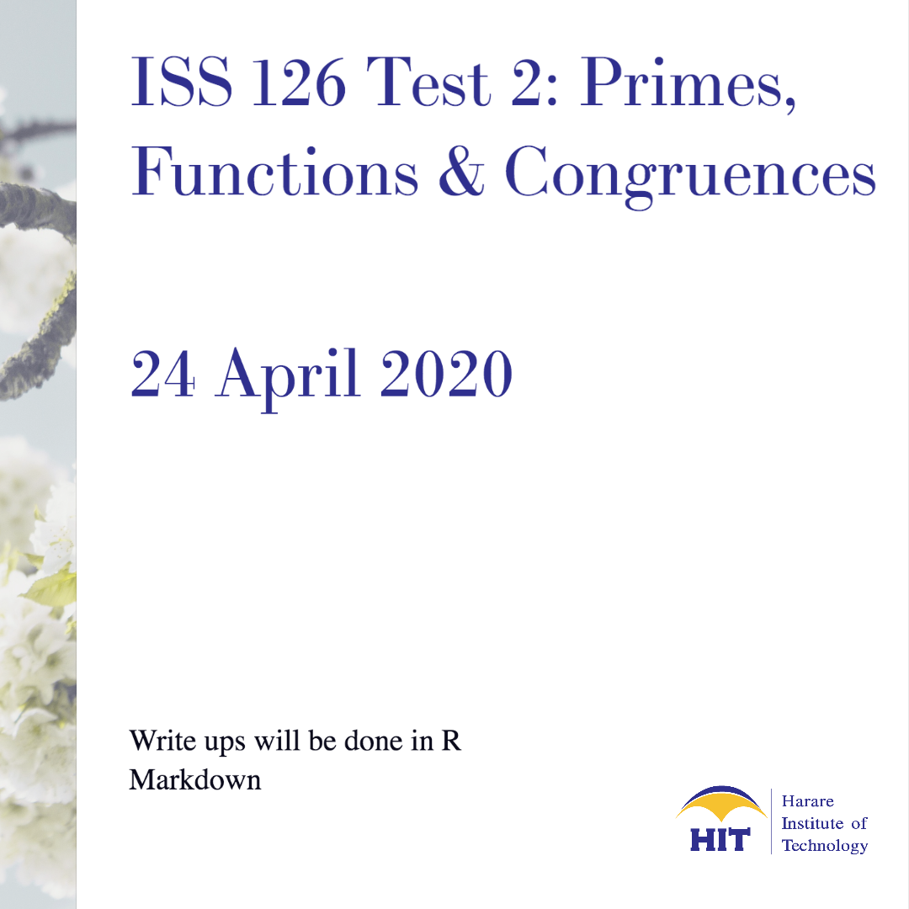

## **Course information** {.tabset .tabset-fade}
<style>
div.blue { background-color:#e6f0ff; border-radius: 5px; padding: 20px;}
</style>
<div class = "blue">
Lecturer: **T. Mutusva**

Office  : W16

Email   : tmutusva@hit.ac.zw

Phone   : +263242 741428-30 Ext 2372

Facebook: @hitmathematics
</div>

Assessment shall comprise of 3 in class tests, one assignment and an end of semester examination. The end of semester examination counts 75%, and the continuous assessment counts 25% towards the final mark. Only those who score an average of 50% in the 3 tests will be allowed to write the end of semester 
examination. All tests and the exam are mandatory. Discuss any potential conflicts well before the test/exam date.


### Lectures/Quiz
***
<center>
{ width=50% }
</center>

***


[Sieve of Eratosthenes](https://spark.adobe.com/page/OBBCMVGXaKuOX/)

[Rstudio: Number Theory](rs2.html)

[Linear Congruences](https://spark.adobe.com/page/bA8Ay1mOKEjAW/)

[Primes, Arithmetic Functions](https://spark.adobe.com/page/0cMkXls6nSsTV/). This link will be
updated on a weekly basis.


***


### Course Content
(@) Divisibility, Modular Arithmetic.
(@) Prime Numbers.
(@) Congruences.
(@) Arithmetical Functions.
(@) Chinese Remainder Theorem, RSA.
(@) Quadratic Reciprocity and Elliptic Curves.

For the detailed Course Outline click the link below:

[Course Outline](https://drive.google.com/file/d/1gRTrf3kjfqblpQ1RVNrUjAJ5WVIR0GMB/view?usp=sharing)


***
### Worksheets


#### 2020

[Worksheet 1 (2020)](https://drive.google.com/open?id=1mNpLaAz5pj-tukVtpg-PcCpLuGjLLJbz),
[Worksheet 2 (2020)](https://drive.google.com/open?id=1f0Lxov-3FO8I1UX61iU7rifLotwPfbGs),
[Worksheet 3 (2020)](https://drive.google.com/open?id=14iLk0e6ghGeNqbR5KnfKzLHgWjPkxWbA)

#### 2019

[Worksheet 2 (2019)](https://drive.google.com/open?id=1IxQjHRzgl7pRVcLeZAmx08HDswfzDZXF),
[Worksheet 3 (2019)](https://drive.google.com/open?id=1t7qbVjqfkI7NbI6Ofeutn-CE4epEePVU),
[Worksheet 4 (2019)](https://drive.google.com/open?id=1ZuceV9EMnIeb9RDp8H3NFUHDSOT_Nct7),
[Worksheet 5 (2019)](https://drive.google.com/open?id=1FBWHWO7qFAVjMFiMs8h1H1okjYaQmbxQ)


***
### Tests

#### **2020**
[Test 1 (2020)](https://drive.google.com/open?id=16_aZQlp_c8178V0y8d9v89E9zdgyXYF1)

#### **2019**

[Test 1 (2019)](https://drive.google.com/open?id=1x45fOVCdbA_2_zk7DFK4e2hjSl-2f0-N),
[Test 2 (2019)](https://drive.google.com/open?id=1fOf75pgH_YapE-bPSAUPoIiJwp4qQixI),
[Test 2 (2019) Model Answers](https://drive.google.com/open?id=1-EePUcEaswaJOzcIHrrcPw9HB0ZQEHeb),
[Test 3 (2019)](https://drive.google.com/open?id=1614w6gezFliBBdhgXC5GXmTF6zifH7jO)

***
### Past Examinations

[Examination (2018)](https://drive.google.com/open?id=1614w6gezFliBBdhgXC5GXmTF6zifH7jO),
[Examination (2019)](https://drive.google.com/open?id=1JQAHPMRKktkCW0e1NF_CJo2PnB6oPBuP)


### Coursework Marks

For fast access, type your surname in the search box.

```{r echo=FALSE}
library(readxl)
cw126<- read_excel("1262020cw.xlsx")
library(DT)
datatable(cw126, rownames = FALSE,  options = list(pageLength = 5, scrollX=T,columnDefs=list(list(targets=2,visible=FALSE),list(className = 'dt-center', targets = 1:4))) )%>%
  formatStyle(
    'Test_1',
    color = styleInterval(c(0.49, 0.75), c('red', 'black', 'green')), fontWeight = 'bold') %>%
  formatPercentage('Test_1', 0)
```

***

