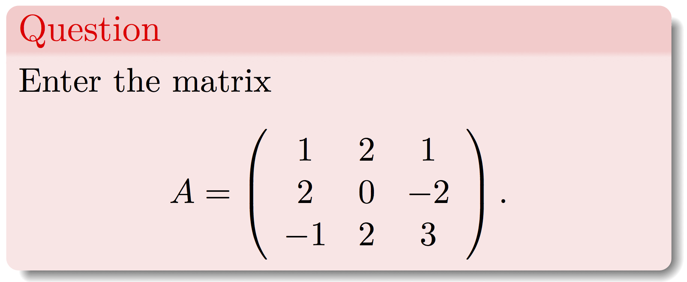
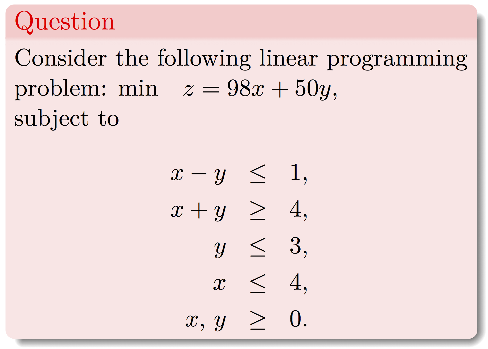
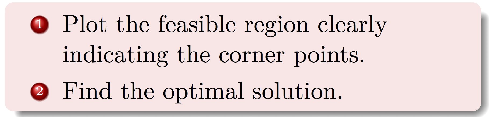

### **Entering Matrices**


To enter a matrix we use the command matrix. The argument ncol specifies the number of desired columns. byrow fills the matrix row by row.

<center>
{ width=80% }
</center>

**Solution**

```{r}
A<-matrix(c(1,2,1,2,0,-2,-1,2,3),ncol=3,byrow=TRUE)
```

```{r}
A
```

### **The Graphical Method**
To solve linear programming problems using the graphical method we are going to use the package gMOIP. After downloading the package, load it using the command

```{r}
library(gMOIP)
```

<center>
{ width=80% }
</center>

<center>
{ width=80% }
</center>

To plot the feasible region we will use the plotPolytope command.Define the model as max/min subject to Ax<=b, x>=0.
A is the matrix of coefficients on the left hand side of the inequality signs. b represents the coeffients on the right had side of the coefficients. obj represents the coefficients of the objective function. 
To use plotPolytope all the constraints must be less or equal to constraints. If there are any greater or equal to contraints first multiply them by -1 to get the required form. In our example we multiply constraint 2 by -1 to get the desired form.

The problem is entered as

```{r}
A <- matrix(c(1,-1,-1,-1,0,1,1,0), ncol = 2, byrow = TRUE)
b <- c(1,-4,3,4)
obj <- c(98,50)
```

To plot the feasible region enter
```{r}
plotPolytope(
   A,
   b,
   obj,
   type = rep("c", ncol(A)),
   crit = "min",
   faces = rep("c", ncol(A)),
   plotFaces = TRUE,
   plotFeasible = TRUE,
   plotOptimum = FALSE,
   labels = NULL
)
```

To label the corner points change the labels command above to "coord"

```{r}
plotPolytope(
   A,
   b,
   obj,
   type = rep("c", ncol(A)),
   crit = "min",
   faces = rep("c", ncol(A)),
   plotFaces = TRUE,
   plotFeasible = TRUE,
   plotOptimum = FALSE,
   labels = "coord"
)
```

To label the optimal solution set the plotOptimum to TRUE

```{r}
plotPolytope(
   A,
   b,
   obj,
   type = rep("c", ncol(A)),
   crit = "min",
   faces = rep("c", ncol(A)),
   plotFaces = TRUE,
   plotFeasible = TRUE,
   plotOptimum = TRUE,
   labels = "coord"
)
```

The optimal solution is z=248.

***
Trevor. N. Mutusva, October 2020.

