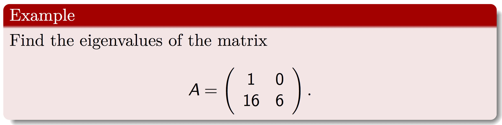

## Eigenvalues and Eigenvectors


Let $A$ be an $n\times n$ matrix, $I_{n}$ the identity $n\times n$
matrix and $\lambda I_{n}$ the diagonal with $\lambda$-scalar. Then
$A-\lambda I_{n}$ is an $n\times n$ matrix and the determinant $|A-\lambda I_{n}|$ is a polynomial which we denote by $P_{N}(\lambda).$ $P_{N}(\lambda)$
is called the characteristic polynomial of $A$. The roots of $P_{N}(\lambda)$
are called eigenvalues of $A$.

 


First enter the matrix
```{r}
A<-matrix(c(1,0,16,6),nrow=2,ncol=2,byrow=TRUE)
```

Then use the command

```{r}
eigen(A,only.value=TRUE)
```

***
Trevor. N. Mutusva, February 2020.

