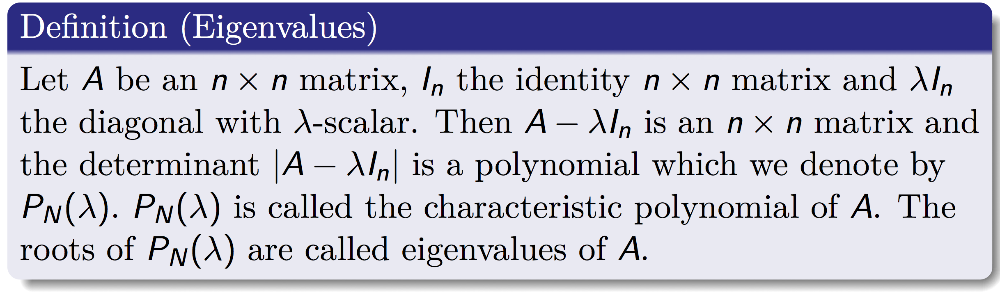
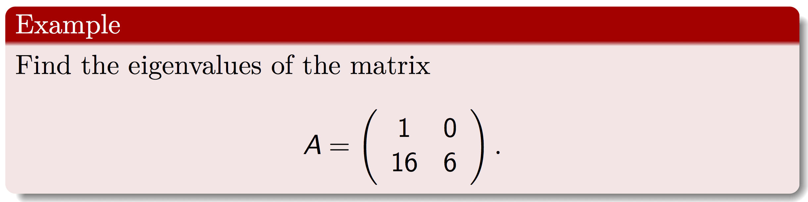
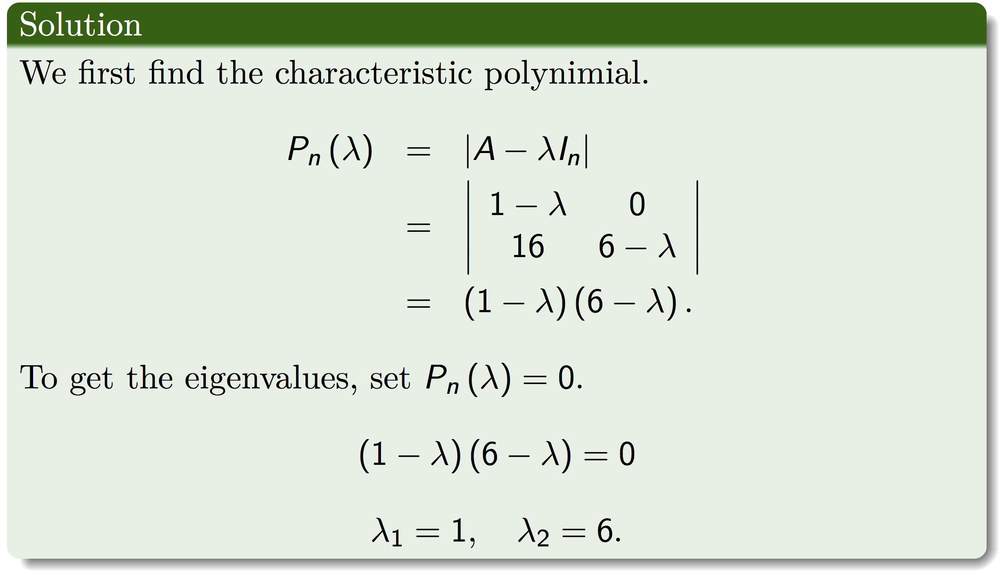

## Eigenvalues and Eigenvectors





 
To find the eigenvalues using R,first enter the matrix

```{r}
A<-matrix(c(1,0,16,6),nrow=2,ncol=2,byrow=TRUE)
```

Then use the command

```{r}
eigen(A,only.value=TRUE)
```


***
Trevor. N. Mutusva, February 2020.

